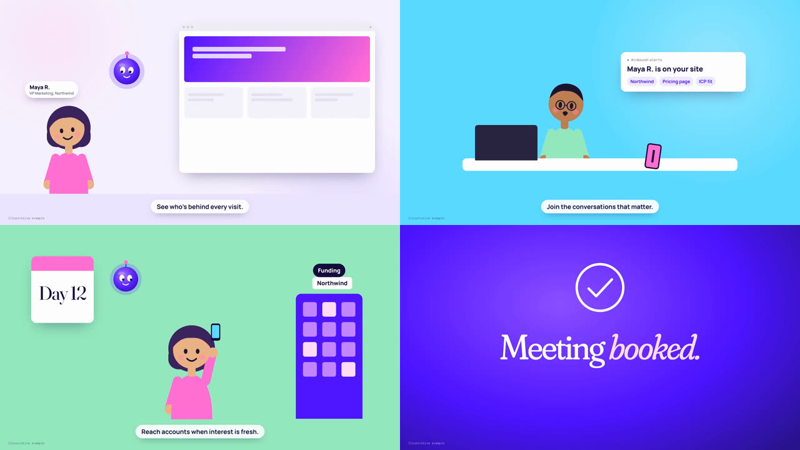

# Breakout Videos

**Breakout's brand, styles and video templates, made with a coding agent.**

One brand kit, a set of proven styles, and a pipeline that turns Breakout's own words into finished videos: launch films, ABM sends to target accounts, teasers. Claude Code (or Codex) writes the story with you, builds every frame from the brand kit, scores it, mixes it, and renders it locally with HyperFrames. The first version of every video is free and needs no accounts.

## What is here

| Folder | What it holds |
|---|---|
| [`brand/`](brand/README.md) | The brand kit (`brand.json`: logo, colours, gradients, fonts, copy) and the **[video guidelines](brand/GUIDELINES.md)**: how a Breakout video looks, sounds and speaks, and every look the owner approved or rejected |
| [`assets/`](assets/) | Shared visuals: real product screens (`screens/`, customer data blurred) and reference images (`refs/`) |
| [`templates/`](templates/README.md) | 10 styles, each a complete template with a worked example film and a poster |
| [`videos/`](videos/README.md) | Where new videos are made, one folder each, copied from a template |
| [`accounts/`](accounts/README.md) | Target accounts for the ABM templates (captures of their site and chat) |
| [`skills/`](skills/README.md) | 10 agent manuals: story, voice, score, sound, mix, review, motion, 3D, brand |
| [`docs/`](docs/) | Setup, costs, rights, the [style log](docs/breakout-style.md) and [style references](docs/styles/aesthetic-options.md) (look tests, moodboard) |
| `scripts/`, `tools/`, `examples/` | `new-video.py`, the pre-commit check, the website-to-brand extractor and its offline test site |

## The templates

| | | |
|---|---|---|
| **Swiss grid**  | **Sequencer**  | **Particle swarm**  |
| **ABM, cinematic**  | **ABM, split screen**  | **Voice-led**  |
| **Kinetic**  | **Cartoon**  | **Analog / psychedelic**  |
| **Dot matrix**  | | |

What each is for, and its verdict: [`templates/README.md`](templates/README.md).

## Start here

1. Install the tools ([setup](docs/setup.md), about 10 minutes on a Mac):

   ```bash
   brew install node ffmpeg uv whisper-cpp fluid-synth
   npm install
   uv venv .venv && uv pip install -r requirements.txt
   ```

2. Open the folder in Claude Code and say what the video is, for example:

   ```text
   Read CLAUDE.md. I want a 30 s launch video for <feature>, <who it's for>.
   Suggest a template, write the brief and storyboard with me, and show me
   stills of every beat before rendering the free version.
   ```

3. Or by hand: `python3 scripts/new-video.py <template> <name>`, edit the data file in `videos/<name>/` (its README says which), and run `videos/<name>/render.sh`. For an ABM send, add the account to `accounts/<slug>/` and run `videos/<name>/render.sh <slug>`.

## How every video is made

1. **Story first.** The owner says what the video is; a brief and a storyboard are written and approved before any frame exists (skill `launch-story`).
2. **Stills before renders.** Every new beat is checked as a still or contact sheet.
3. **Free before paid.** A free render (scratch voice or none, a free orchestral or synthesised score, synthesised sound effects) comes first; paid generation only on the team's account after the cost is stated and approved ([costs](docs/costs.md)).
4. **Review.** `skills/launch-review/scripts/review.py` measures the render (cuts, static runs, loudness, the beat grid) and writes a contact sheet; the verdict goes in the [style log](docs/breakout-style.md).

The rules behind this (claims, competitors, rights, real UI) are in [`CLAUDE.md`](CLAUDE.md) and the [guidelines](brand/GUIDELINES.md).

Adapted from the MIT-licensed launch-video-kit ([license](LICENSE), [third-party notices](THIRD_PARTY_NOTICES.md)).
