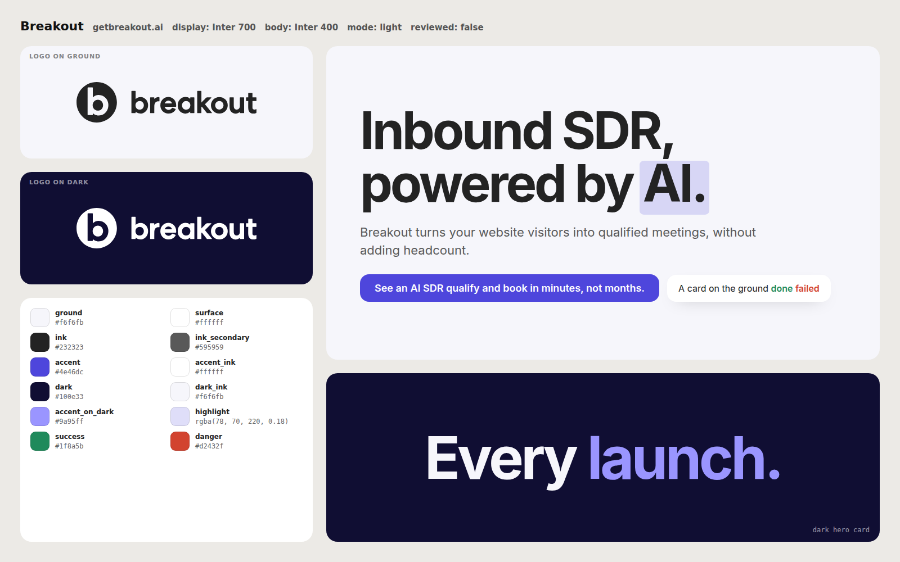

# Breakout video guidelines

How a Breakout video looks, sounds and speaks. This page sums up the brand kit ([`brand.json`](brand.json), [`README.md`](README.md)) and what the owner approved or rejected so far (the verdicts, in their words, are in the [style log](../docs/breakout-style.md)). The templates in [`templates/`](../templates/README.md) already follow it, so start a video from one of them.

## Brand

| | |
|---|---|
| Logo | The two-tone wordmark exactly as the app shows it: `logo.svg` on light ("break" `#1C1778`, "out" `#4E46DC`), `logo-on-dark.svg` on dark. The b-disc mark (`mark.svg`, `mark-on-dark.svg`) is for avatars and small chrome, never the lockup. The original file comes from the team Drive (`source/`). |
| Violet | `#4c00ff` is the centre of every film: the one element per shot that matters, success states, key words. On dark it becomes lilac `#be79ff`; for brighter worlds, blush `#ffd6f5` and pink `#ff5ad1` sit around it. |
| Grounds | Off-white `#f4f4f4` and white for light scenes; deep indigo `#140b3c` and the homepage's violet mesh (`gradients.dark_mesh`) for dark ones; bright lavender `#f6f1ff` behind product UI. Grey `#17161b` only for a competitor's side. |
| Ink | `#040405` headlines, `#5c5850` secondary text. |
| Type | Headlines in **New Kansas** (the site's face, from Adobe Fonts; the open stand-in **Fraunces** with `SOFT` 100 renders when New Kansas is not installed), key words in *italic*. **Manrope** for UI, labels and body. **Fragment Mono** for small technical labels (indexes, sources, timecodes). The minimal templates set big type slams in Manrope 800. |

## Voice and words

- Challenger brand: direct, confident, optimistic about AI. Short sentences, 1 idea per line, lead with a verdict.
- Words come from Breakout's own copy (`brand.json` `copy`, the Brand Guide for Writers). Keep existing lines verbatim. Never invent a number, customer or claim; an unknown fact stays unknown until the owner confirms it.
- **Little text, held long enough to read.** A short line holds about 2 s; anything longer gets a read hold and a slow drift rather than a cut. A comparison shows a 2 to 4 word fragment a side, never a paragraph ("a little too texty"; "very fast... slow it down, esp the text-heavy sections").
- No section titles or numbering in persuasion films ("Remove the section title"). Mono indexes belong only to the Swiss-grid look, where they are part of the grid.

## Product and people

- Show the real product: screens in `assets/screens/` (customer data blurred or replaced; never commit an unblurred screen) or UI rebuilt in code from those screens, with its real copy ("Go ahead. Ask me stuff.", "Book a Meeting").
- The success state is violet flooding out of the action into "Meeting *booked.*", a drawn check and the booked card.
- Example accounts, visitors, emails and meetings are fictional ("Northwind", "Maya R.") and labelled "Illustrative example" on screen. A real company named as an example appears in plain type, never its logo, with the same label.
- Generated people are fictional: no famous people, lookalikes, real films or third-party brands. Scratch voices are for timing only and never published (`docs/rights.md`).

## Competitors

Never show a competitor's name or logo, with one exception: the ABM templates may name Qualified, only in lines quoted verbatim from getbreakout.ai/compare/qualified-alternative, never with its logo. A target's chat widget appears only as captured on the target's own site, and anything said about it describes that capture. Show the source on screen while a quote is up.

## Motion

- Something moves from frame 1; no static title cards.
- Hard cuts land on the beat; big reveals on downbeats. Type cuts in with a short rack focus (a blur that clears) and a small rise.
- One object becomes the next (the play button opens into the email, violet floods out of Send) instead of a stock transition.
- Push into the one part of the UI that matters; the whole window at thumbnail size says nothing.
- Every frame is a pure function of time, so any second can be checked as a still.

## Sound

- No narrator unless the template is voice-led. Music and sound effects carry the film.
- The owner prefers an **orchestral** score ("more orchestra-y") over a scratch electronic bed: pizzicato, timpani, string stabs, horns, E major for the win. It is written as MIDI on the film's bar grid and rendered free; paid music generation only after stating the cost and getting a yes.
- Master at -14 LUFS integrated, true peak at or under -1 dBTP after AAC encoding (mix with a -3.2 dBTP ceiling). A beat of silence before the biggest moment; near silence under the logo.

## Looks, by verdict

| Look | Template | Verdict |
|---|---|---|
| Swiss grid: off-white, hairlines, mono indexes, huge type slams | `swiss-grid` | Approved ("i like 03"; "This is great.") |
| Concept film on the grid, picture and music from one pattern | `sequencer` | Approved ("I love this.") |
| Particle swarm, music-video motion | `particle-swarm` | Liked ("ok this is cool") |
| Kinetic: minimal, colourful colour-field floods, a product moment per beat | `kinetic` | Requested by the owner ("minimal, fast, colorful, quick motion"); awaiting a verdict |
| Cinematic: bright violet worlds, letterbox, grain, hard cuts | `abm-cinematic` | Requested by the owner; awaiting a verdict |
| Split screen, low on text, the user experience side by side | `abm-split` | Requested by the owner; awaiting a verdict |
| Voice-led Apple-style launch | `voice-led` | The kit's base; not yet judged |
| Analog, vintage, psychedelic | `analog-psych` | Rejected for product launches ("more modern, more unexpected"); kept as a style to draw on |

More directions to explore are in [`docs/styles/`](../docs/styles/aesthetic-options.md) (look tests and the moodboard).

## Formats

16:9 at 1920x1080 first; vertical cuts later. 30 fps. Launch films 25 to 45 s; ABM sends 35 to 45 s; teasers 6 to 10 s. Keep the full-quality master; make a compressed preview for chat and email when a file is over about 25 MB.
