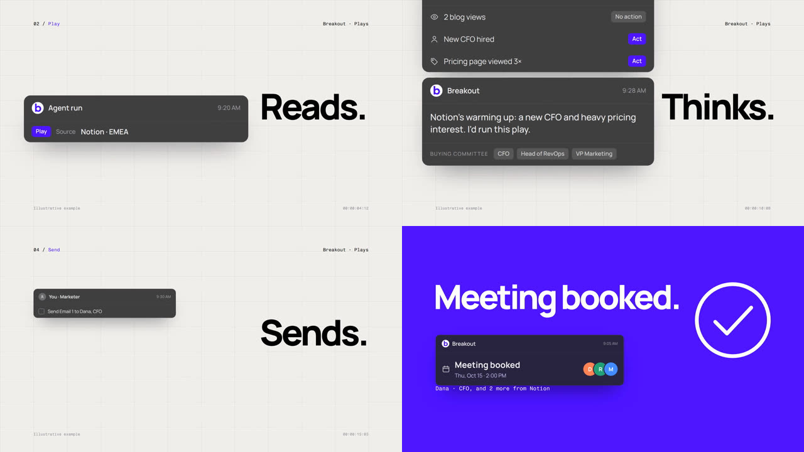
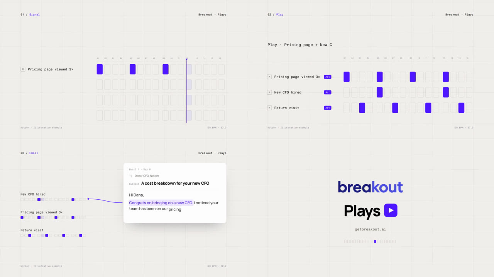
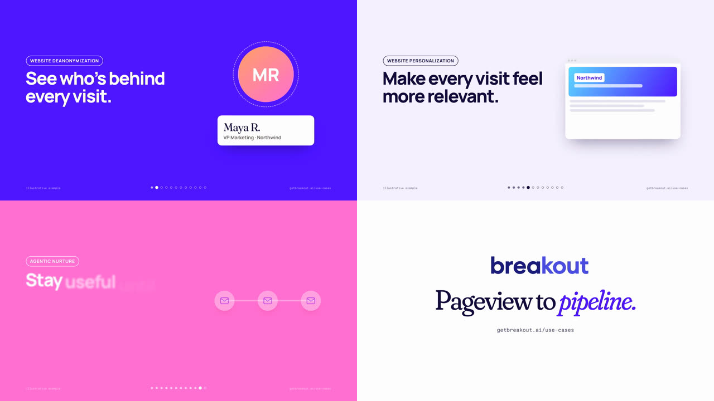
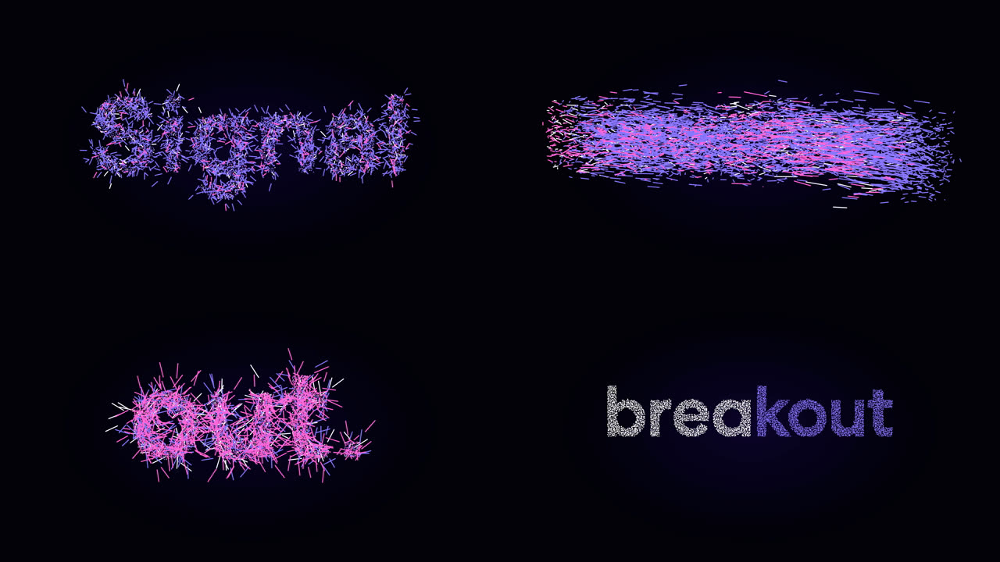
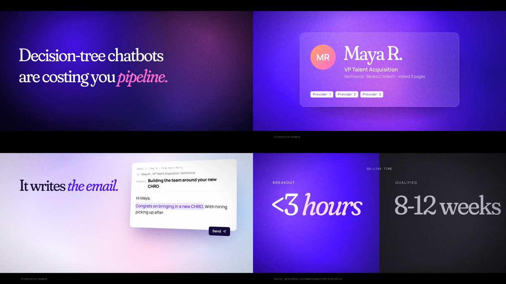
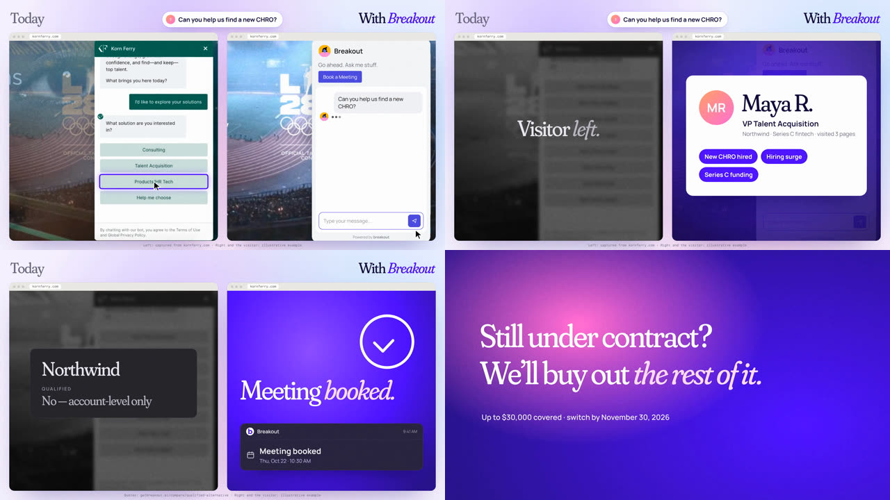
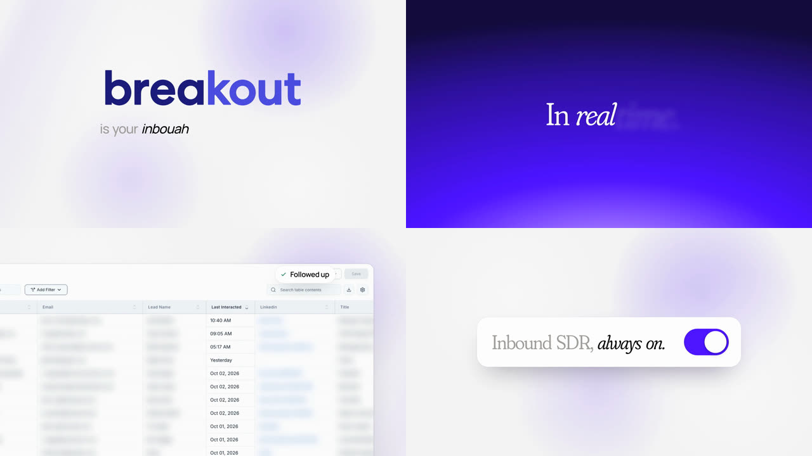
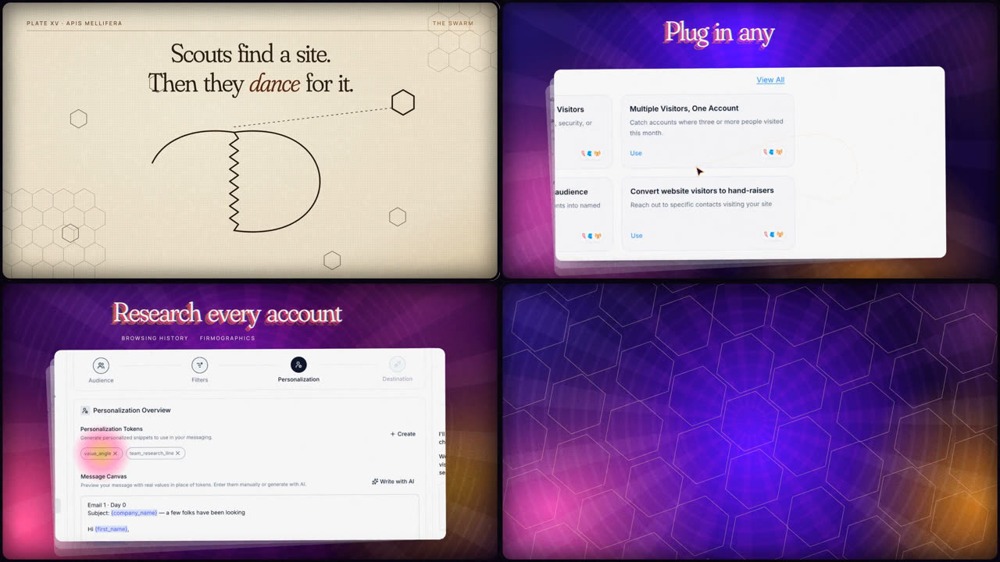

# Templates

Each folder is one video style (8 so far), complete with a worked example film: its data file (the words, beats and timing), its look (`template.html`), and the scripts that build, score, mix and render it. Never edit a template to make one video. Copy it first:

```bash
python3 scripts/new-video.py                         # list the templates
python3 scripts/new-video.py swiss-grid q4-launch    # -> videos/q4-launch/
```

Then follow the order in `CLAUDE.md`: brief and storyboard approved first, then stills of every beat, then the free render. The brand rules all templates share are in [`brand/GUIDELINES.md`](../brand/GUIDELINES.md).

| Template | Looks like | Use it for | Verdict |
|---|---|---|---|
| [`swiss-grid`](swiss-grid/README.md) |  | A crisp, wordless product story under 30 s; UI as cards; a big success state | Approved |
| [`sequencer`](sequencer/README.md) |  | A one-idea concept film where the music is built from the picture | Approved |
| [`kinetic`](kinetic/README.md) |  | A fast, colourful look and its 12 product moments; put it inside a story, not a list | List format rejected ("doesn't have a story") |
| [`particle-swarm`](particle-swarm/README.md) |  | Teasers, openers, logo reveals, 6 to 10 s social cuts | Liked |
| [`abm-cinematic`](abm-cinematic/README.md) |  | Per-account ABM: their site and chat, a hard-cut hook, wins, an offer | Awaiting a verdict |
| [`abm-split`](abm-split/README.md) |  | Per-account ABM: the same visitor on their site today and with Breakout | Awaiting a verdict |
| [`voice-led`](voice-led/README.md) |  | Narrated launch films, 30 to 60 s, hooks on a shared body | The kit's base |
| [`analog-psych`](analog-psych/README.md) |  | Conceptual brand pieces with a nerdy-fact hook | Rejected for launches; kept as a style |

## What every template has

| File | What it is |
|---|---|
| `README.md`, `poster.jpg` | What it looks like, when to use it, the verdict, and how its example was made |
| `BRIEF.md`, `STORYBOARD.md` | The example film's story (replace them for a new video) |
| a data file (`film.json`, `series.json`, `split.json`) | The words, beats and timing. Edit this first |
| `template.html` (voice-led: `templates/body.html`) | The look and the motion; every frame is a pure function of time |
| `build.py` | Data + `brand/brand.json` -> a HyperFrames project in the folder |
| a score script (`bed.py`, `orchestra.py`, `score.py`) and `audio.py` | The free music, the sound effects and the -14 LUFS mix |
| `render.sh` | Build, render and mix in one go |

The ABM templates read their account data from [`accounts/`](../accounts/) and render one film per account into `out/<account>/`.

## Make a new template

Copy the closest template into `templates/<new-style>/`, change its look in `template.html`, give it a `README.md` that starts with a title and a one-sentence description (the list in `new-video.py` reads it), a `poster.jpg`, and log the look's verdict in [`docs/breakout-style.md`](../docs/breakout-style.md).
