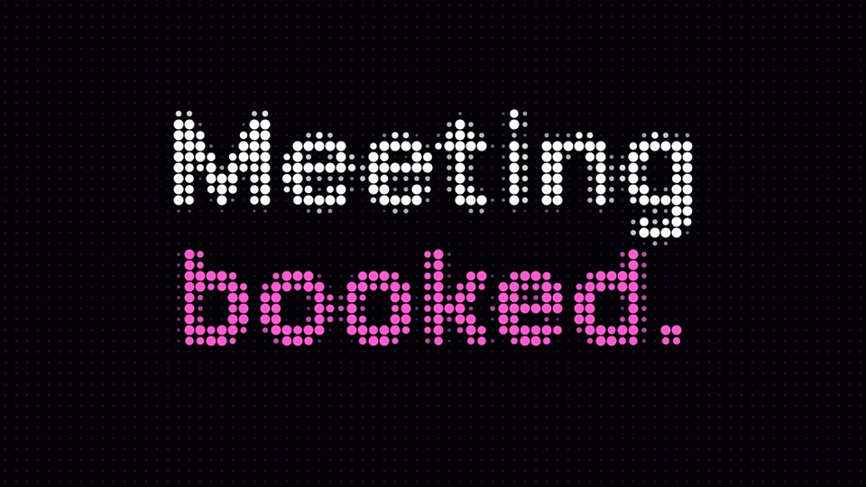

# Dot matrix

A wordless story told by one grid of dots: the visitor, Breakout and the rep are blooms of dots that snap on the beat, trade ripples and merge; the words at the end are dots too.

| | |
|---|---|
| Use it for | Brand films and product stories told abstractly, with no UI or people on screen; social cuts. Small captions only. |
| Verdict | Round 18, awaiting a verdict. The look was chosen from the abstract reel (owner: "Use the dot matrix style"); the notes for this film: "Use very cool snappy motion. A jazzy atmospheric soundtrack. Add an Easter egg joke. Keep the captions small and precise". |
| New video | `python3 scripts/new-video.py dot-matrix <name>`, then edit the copy in `videos/<name>/` |

## The example film

**"Full suite, in dots"**: an anonymous visitor (grey) is seen (pink), gets a first conversation with Breakout (violet), the rep (cyan) is called in; the visitor leaves; Breakout follows up, then waits out the long game by playing Snake (the easter egg), eating each signal with a score in the corner; the visitor comes back, they merge, "Meeting *booked.*", the wordmark and "Pageview to *pipeline.*". 40 s at 96 BPM swing, with a free jazz score. Captions are the use-case page headlines, verbatim. Story in [`STORYBOARD.md`](STORYBOARD.md).

## Make your own

Edit `film.json`:

| Field | What it does |
|---|---|
| `at` | When each beat starts, in bars (dark, seen, engage, rep, gone, follow, game, back, booked, close, end) |
| `captions[]` | Small captions: `text`, `at` and `until` in bars; they cut in and out on those bars |
| `colors` | Ground, idle dot, visitor, anonymous visitor, Breakout, rep, signal and snake colours |
| `game` | The easter egg: the corner label, the signal cells (on the 80 x 45 dot grid) and the snake's step in bars |
| `booked.lines`, `lockup.line` | The words spelled in dots (`*key*` lines in the visitor colour) and the closing line |

The motion lives in `template.html` (`frame(t)` redraws the grid from nothing, so every frame is a pure function of time). The score is `score.py` (a General MIDI band, swung, cued from `at`); the sound cues are in `audio.py`.

| File | What it does |
|---|---|
| `build.py` | `film.json` + `brand.json` -> `index.html`, `compositions/dots.html` (the logo's paths are embedded and sampled onto the grid) |
| `score.py` | The jazz score -> `score/score.wav` |
| `audio.py` | Sound cues, the mix at -14 LUFS and the mux |
| `render.sh` | All of it -> `renders/<folder>.mp4` |
